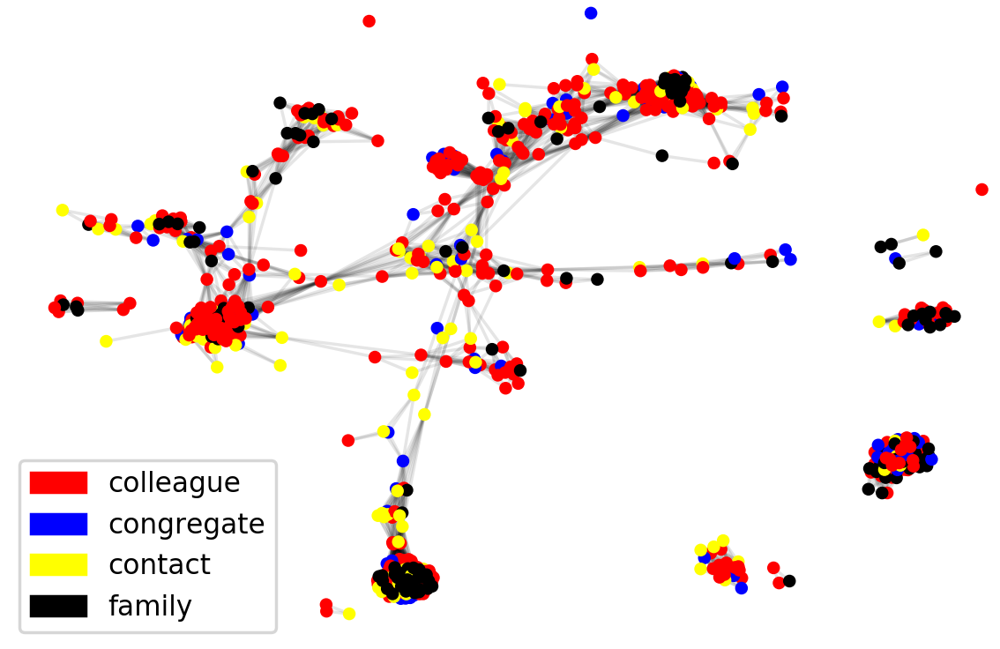

# TerrorAttacksNtds

Repository of group 29 of the Network Tour of Data Science EPFL unit. See https://github.com/mdeff/ntds_2018 for more details.

## Project Description

The project consists in trying to predict the location of a terror attack based on its features, as well as analyse the network of the terrorist relationships. 

## Repository structure

`data` contains the data used to build the graphs

`notebooks` contains the Jupyter notebooks used to process the data and analyse it

`report` contains the LaTeX files for the report, as well as a PDF version

## Resources

(From https://github.com/mdeff/ntds_2018)

### Terrorist Attack dataset

The first dataset consists of 1293 terrorist attacks (nodes), each of which is assigned to one of 6 labels indicating the type of the attack. Each attack is described by a 0/1-valued vector of attributes whose entries indicate the absence/presence of a feature. There are a total of 106 distinct features. The files in the dataset can be used to create two distinct graphs. In one of them edges of the graph connect the colocated attacks. On the other one, edges connect co-located terrorist attacks performed by the same terrorist organization. 

The files used for this part of the project can be found `notebooks : predictionV2 - processData - graphs `.

|          | Description                                                     | Amount |
| -------- | --------------------------------------------------------------- | ------:|
| nodes    | terrorist attacks                                               |  1,293 |
| edges    | connect co-located attacks                                      |  3,172 |
| features | 0-1 vector of attribute values                                  |    106 |
| labels   | kind of attack: arson, bombing, kidnapping, weapon, nbcr, other |      6 |

### Terrorist relationship dataset

The second dataset is designed for the classification of the relationships between the terrorists. The dataset contains 851 relations (aka; nodes of the graph). Each node is assigned to least one label (multiple labeling is also possible) among 4 labels; "Colleague", "Congregate", "Contact", "Family", and is described with 0/1 valued feature vector indicating absence/presence of the attributes, which are 1224 in total. There are 8592 edges on the graph, which connects the nodes involving the same terrorist group. As the goal is the classification of links, we will here build the line graph of the social network between terrorists. That is, instead of having terrorists as nodes and relationships between them as edges, relationships will be nodes and terrorists will be edges.

The files used for this part of the project can be found `notebooks : TerrRel`.

|          | Description                                                                  | Amount |
| -------- | ---------------------------------------------------------------------------- | ------:|
| nodes    | relationships                                                                |    851 |
| edges    | terrorists                                                                   |  8,592 |
| features | 0-1 vector of attribute values                                               |  1,224 |
| labels   | type of relationship (non exclusive): colleague, congregate, contact, family |      4 |

## External resources for the datasets:
* <https://linqs.soe.ucsc.edu/node/236>
* <http://www.cs.umd.edu/~sen/lbc-proj/LBC.html>
* Paper: <https://pdfs.semanticscholar.org/c047/f91ece3e9ec74bf42b8f69f375e27498a54a.pdf>
* Data: <https://linqs-data.soe.ucsc.edu/public/lbc/TerrorAttack.tgz>
* Data: <https://linqs-data.soe.ucsc.edu/public/lbc/TerroristRel.tgz>

